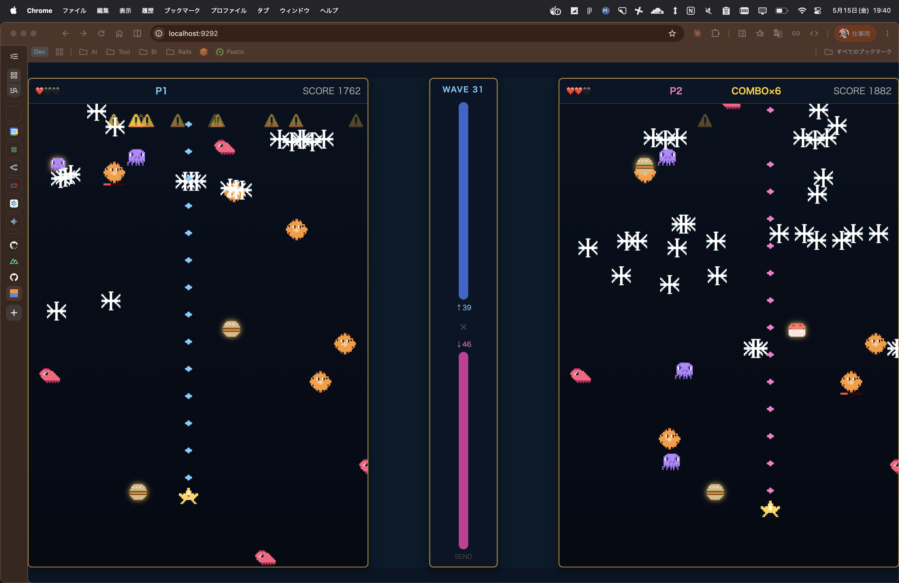

# async-cafe（ハコダテヴァーサス）

Ruby + [Lively](https://github.com/socketry/lively) + Async ベースの 2 人対戦シューティングゲーム。
1 台の端末を 2 人で共有してプレイする、ローカル対戦型のブラウザゲームです。



## 必要環境

- Ruby（`gems.rb` の指定に従う）
- Bundler

## セットアップ

依存ライブラリをインストールする:

```sh
bundle install
```

## 起動（Build & Server）

ローカルでサーバーを起動する:

```sh
BUNDLE_GEMFILE=gems.rb BUNDLE_LOCKFILE=gems.locked bundle exec lively ./application.rb
```

起動後、標準出力に表示される URL（既定では `http://localhost:9292`）をブラウザで開くとタイトル画面が表示されます。

## テスト

全テスト実行:

```sh
bundle exec sus test/
```

個別テスト:

```sh
bundle exec sus test/<file>.rb
```

## 詳細ドキュメント

- 開発ガイド・コマンド一覧 → [`CLAUDE.md`](CLAUDE.md)
- 設計判断（ADR） → [`docs/adr/`](docs/adr/)
